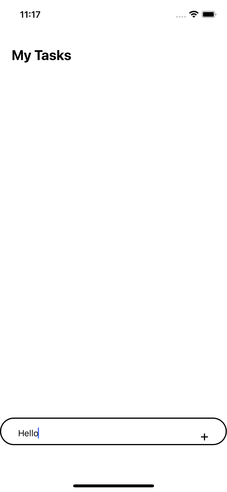

#TODO-LIST using  React Native

Designed this cross platform todo-list app to add and delete tasks. 
Tasks can be added by writing down on the text input and then pressing the add button. Whereas the tasks can be removed by clicking on the respective tasks. 

To use this app perform the following -
> Firsly fork the app.
> Then Clone it.
> After coning the app, move to that todolist-app-rn directory.
> then run "npm install".
> Run "npx expo start" to run the expo server.
> Open the app in Android, iOS emulators or your personal device by scanning the QR.

